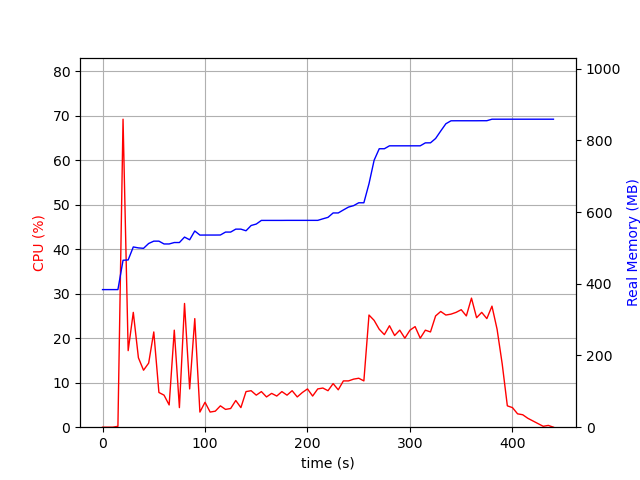
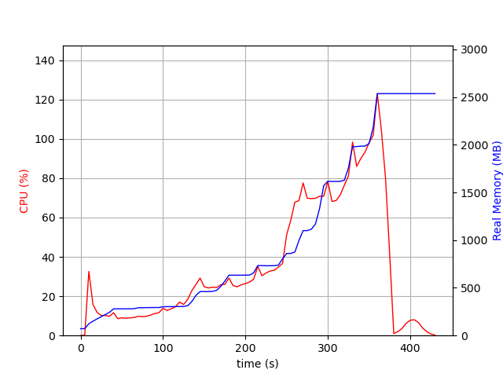

# Benchmark Linguagens

## Execução dos testes

- Subida de uma aplicação por vez. Na implementação atual, ambas sobem na porta `5175`
- Uso do `psrecord` para gerar o gráfico de uso de memória e CPU: `psrecord <PID> --interval 5 --plot image.png`
- Na pasta `gatling-test` foi executado o comando para iniciar a simulação: `mvn gatling:test -Dgatling.simulationClass=test.scala.test.LoadSimulation`
- Os resultados se encontram na pasta `gatling-results`

## Teste padrão

| Métrica                       | Spring                | .NET                |
|-------------------------------|-----------------------|---------------------|
| **Tempo de inicialização**    | 1900 ms               | 61 ms               |
| **Quantidade de requisições** | 209,100               | 209,100             |
| **Com sucesso**               | 202,807               | 209,100             |
| **Com erro**                  | 6,293                 | 0                   |
| **Porcentagem de erro**       | 3%                    | 0%                  |
| **Pico de usuários**          | 28,732                | 15,419              |
| **Tempo médio de resposta**   | 300 ms (86% do tempo) | 2 ms (99% do tempo) |

### Uso de Memória e CPU Spring

### Uso de Memória e CPU .NET

### Observações Importantes

- A proposta do teste foi realizar a comparação em um cenário de implementação base, sem ajustes de ambos os lados, com isso:
    - Um cenário mais próximo de comparação seria com o Spring WebFlux
    - O uso de memória e CPU foi muito superior, uma comparação mais justa aqui também seria realizar o teste com recursos controlados
- O tempo de inicialização definitivamente é menor, mas não pode ser medido de maneira equalitária, a aplicação .NET não loga essa informação automaticamente
- Não foi possível isolar a performance apenas do banco de dados em memória

## Testes com ambiente e implementações mais próximas

Em construção