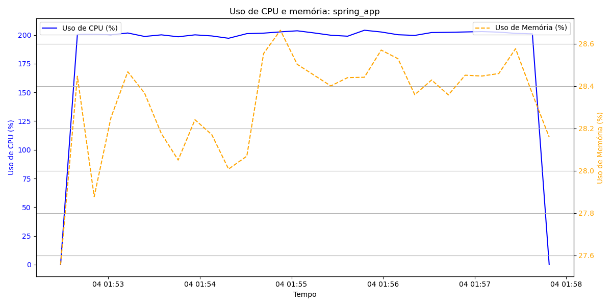

# Benchmark Linguagens

## Execução dos testes de gravação em banco de dados

A proposta aqui é executar simulando um ambiente restrito para ambas as aplicações, utilizando o docker com os parâmetros de `1.5g` para memória e `2` para cpus. Nos respectivos Dockerfiles foram inseridos parâmetros para as aplicações, considerando essas limitações. 

Iniciando a execução para a aplicação Spring:

- Executar o banco de dados PostgreSQL com o comando `docker run --network host --name postgres-db -e POSTGRES_USER=user -e POSTGRES_PASSWORD=pass -e POSTGRES_DB=db postgres`
- No projeto `simple-api-db-spring` fazer um `gradle build` e executar o comando: `docker build -t spring_app .`
- Para rodar a aplicação: `docker run --network host --name spring_app --memory="1.5g" --cpus="2" spring_app`
- Opcionalmente, em outro terminal, executar o script na pasta `docker-monitor` para gerar um gráfico de uso de memória e CPU com o comando: `python docker-monitor.py spring_app`. Para interromper a coleta ao fim do teste, aperte `Ctrl + C` no terminal em execução.
- Na pasta `gatling-test` executar o comando para iniciar a simulação: `mvn gatling:test -Dgatling.simulationClass=test.LoadSimulation`
- Opcionalmente, para validar as inserções:
  - Para acessar o container: `docker exec -it postgres-db psql -U user -d db`
  - Na linha de comando que abrir, executar o comando `SELECT * FROM uuids;`
  - Por fim, basta digitar `exit` para sair

Iniciando a execução para a aplicação .NET:

- Executar o banco de dados PostgreSQL com o comando `docker run --network host --name postgres-db -e POSTGRES_USER=user -e POSTGRES_PASSWORD=pass -e POSTGRES_DB=db postgres`
- No projeto `SimpleApiDbDotnet` executar o comando: `docker build -t dotnet_app .`
- Para rodar a aplicação: `docker run --network host --name dotnet_app --memory="1.5g" --cpus="2" dotnet_app`
- Opcionalmente, em outro terminal, executar o script na pasta `docker-monitor` para gerar um gráfico de uso de memória e CPU com o comando: `python docker-monitor.py dotnet_app`. Para interromper a coleta ao fim do teste, aperte `Ctrl + C` no terminal em execução.
- Na pasta `gatling-test` executar o comando para iniciar a simulação: `mvn gatling:test -Dgatling.simulationClass=test.LoadSimulation`
- Opcionalmente, para validar as inserções:
  - Para acessar o container: `docker exec -it postgres-db psql -U user -d db`
  - Na linha de comando que abrir, executar o comando `SELECT * FROM "UUIDEntities";`
  - Por fim, basta digitar `exit` para sair

| Métrica                       | Spring                 | .NET                    |
|-------------------------------|------------------------|-------------------------|
| **Quantidade de requisições** | 209100                 | 209100                  |
| **Com sucesso**               | 209100                 | 209100                  |
| **Com erro**                  | 0                      | 0                       |
| **Porcentagem de erro**       | 0%                     | 0%                      |
| **Pico de usuários**          | 15420                  | 15422                   |
| **Tempo médio de resposta**   | 2 ms (99.25% do tempo) | 19 ms (99.28% do tempo) |
| **Tempo máximo de resposta**  | 390 ms                 | 3967 ms                 |

## Execução de cálculo da sequência de Fibonacci

Esse teste tem como objetivo validar o cálculo da sequência de Fibonacci até o número `250` da sequência. Como é a mesma aplicação, será necessário executar o banco de dados, apesar de nesse cenário, nenhuma gravação ser realizada.

Iniciando a execução para a aplicação Spring:

- Executar o banco de dados PostgreSQL com o comando `docker run --network host --name postgres-db -e POSTGRES_USER=user -e POSTGRES_PASSWORD=pass -e POSTGRES_DB=db postgres`
- No projeto `simple-api-db-spring` fazer um `gradle build` e executar o comando: `docker build -t spring_app .`
- Para rodar a aplicação: `docker run --network host --name spring_app --memory="1.5g" --cpus="2" spring_app`
- Opcionalmente, em outro terminal, executar o script na pasta `docker-monitor` para gerar um gráfico de uso de memória e CPU com o comando: `python docker-monitor.py spring_app`. Para interromper a coleta ao fim do teste, aperte `Ctrl + C` no terminal em execução.
- Na pasta `gatling-test` executar o comando para iniciar a simulação: `mvn gatling:test -Dgatling.simulationClass=test.FibonacciSimulation`

Iniciando a execução para a aplicação .NET:

- Executar o banco de dados PostgreSQL com o comando `docker run --network host --name postgres-db -e POSTGRES_USER=user -e POSTGRES_PASSWORD=pass -e POSTGRES_DB=db postgres`
- No projeto `SimpleApiDbDotnet` executar o comando: `docker build -t dotnet_app .`
- Para rodar a aplicação: `docker run --network host --name dotnet_app --memory="1.5g" --cpus="2" dotnet_app`
- Opcionalmente, em outro terminal, executar o script na pasta `docker-monitor` para gerar um gráfico de uso de memória e CPU com o comando: `python docker-monitor.py dotnet_app`. Para interromper a coleta ao fim do teste, aperte `Ctrl + C` no terminal em execução.
- Na pasta `gatling-test` executar o comando para iniciar a simulação: `mvn gatling:test -Dgatling.simulationClass=test.FibonacciSimulation`

| Métrica                       | Spring   | .NET     |
|-------------------------------|----------|----------|
| **Quantidade de requisições** | 10000000 | 10000000 |
| **Com sucesso**               | 10000000 | 10000000 |
| **Com erro**                  | 0        | 0        |
| **Porcentagem de erro**       | 0%       | 0%       |
| **Tempo médio de resposta**   | 29 ms    | 13 ms    |
| **Tempo máximo de resposta**  | 219 ms   | 1225 ms  |
| **99th pct**                  | 88 ms    | 52 ms    |
| **Duração do teste**          | 5m 6s    | 2m 10s   |

